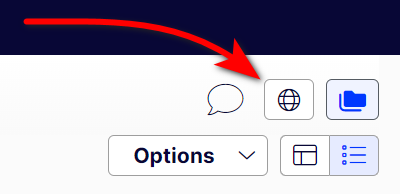

# Gulla.Episerver.Globe for CMS 12

This is the readme for the CMS 12 version, the version for CMS 11 is [over here](https://github.com/tomahg/Gulla.ViewOnWebsite/tree/CMS11).

## The good old days

In Episerver CMS prior to the [UI refresh](https://world.episerver.com/blogs/ryan-bare/dates/2019/6/cms-ui-refresh/) in Episerver.CMS.UI 11.21.0 we were able to open the current content, and see what our visitors would see, by simply clicking the globe on the toolbar.

## A roller coaster

In Episerver.CMS.UI 11.21.0 the globe disappeared! In Episerver.CMS.UI 11.30.0 it was back! But not for long! In EPiServer.CMS.UI 12.22.0 it was removed again!

## Get the globe back

Using this module, you'll get that old familiar globe back on your toolbar!

## Installing

-   Install **Gulla.Episerver.Globe** nuget package 
    ```cs
    dotnet add package Gulla.Episerver.Globe --version 1.1.0
    ```
-   Add following lines to **ConfigureServices** in **Startup.cs**
    ```cs
    services.AddGlobe();
    ```


And, once again, the globe is back!



More information in [this blog post](https://www.gulla.net/no/blog/put-the-globe-back-in-episerver/).

Also, [The globe is back!](https://www.gulla.net/no/blog/the-globe-is-back/)

And, [Gone again!](https://www.gulla.net/en/blog/optimizely-cms-with-new-menu-system/)
