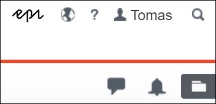
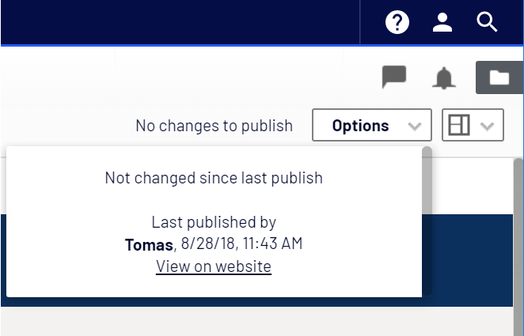

# Gulla.ViewOnWebsite

## The good old days
In Episerver CMS prior to the [UI refresh](https://world.episerver.com/blogs/ryan-bare/dates/2019/6/cms-ui-refresh/) in Episerver.CMS.UI 11.21.0 we were able to open the current content, and see what our visitors would see, by simply clicking the globe on the toolbar.

## The new stuff
In Episerver.CMS.UI 11.21.0 the globe disappeared! We would first have to click «Options» and then «View on website» to accomplish the same. That is one more click I do not want to do.

## Get the globe back
Using this module, you'll get that old familiar globe back on your toolbar! Clicking the globe, will open the current content in a new tab. Nothing more, nothing less.

