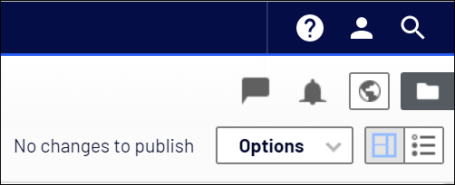

# Gulla.ViewOnWebsite for CMS 11

This is the readme for the CMS 12 version, the version for CMS 11 is [over here](https://github.com/tomahg/Gulla.ViewOnWebsite/).

## The good old days

In Episerver CMS prior to the [UI refresh](https://world.episerver.com/blogs/ryan-bare/dates/2019/6/cms-ui-refresh/) in Episerver.CMS.UI 11.21.0 we were able to open the current content, and see what our visitors would see, by simply clicking the globe on the toolbar.

## The new stuff

In Episerver.CMS.UI 11.21.0 the globe disappeared! We would first have to click «Options» and then «View on website» to accomplish the same. That is one more click I do not want to do.

## Get the globe back

Using this module, you'll get that old familiar globe back on your toolbar! Clicking the globe, will open the current content. Nothing more, nothing less.

More information in [this blog post](https://www.gulla.net/no/blog/put-the-globe-back-in-episerver/).

Also, [The globe is back!](https://www.gulla.net/no/blog/the-globe-is-back/)
